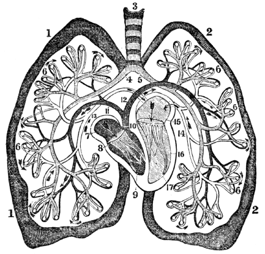
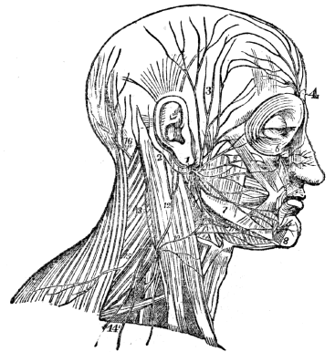
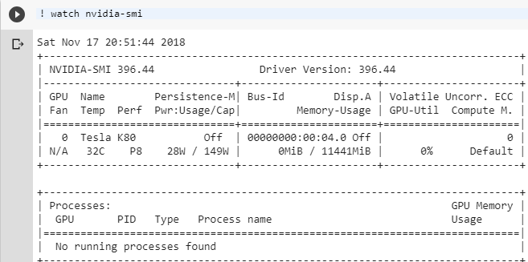
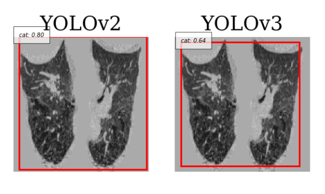

# Applied Medical Deep Learning, 2019



Github: https://github.com/deeponcology/PyTorchMedicalAI

## Old course:
- https://github.com/deeponcology/applied-dl-2018
- The curriculum of the first 2018 course: http://deep-ml.com/assets/5daydeep/#/

## Author
Shlomo Kashani, Head of AI at DeepOncology AI, 
Kaggle Expert, Founder of Tel-Aviv Deep Learning Bootcamp: shlomo@deeponcology.ai


# Google Collab + PyTorch Notebooks:

## Requirements: 
Knowledge of python programming Basics of linear algebra and statistics 

## Environment : 
Google Collab, Google Cloud, Python Jupyter
 




# Labs:

## Lab 0001: Deep Learning Computer Vision Crash Course with PyTorch 0.4 /1.0


- Collab Jupyter: https://colab.research.google.com/drive/1JEIeD_445sFvcjSrITB5Z_oW8VHRS_kA
 
- Git: https://github.com/deeponcology/PyTorchMedicalAI/blob/master/shlomo_dl_0001_cuda_collab_pytorch.ipynb
 

PyTorch is an open source deep learning framework that’s quickly become popular with AI researchers for its ease of use, clean Pythonic API, and flexibility. With the preview release of PyTorch 1.0, developers can now seamlessly move from exploration to production deployment using a single, unified framework.

### DevOps for PyTorch on Google Cloud

  - Google Collab setup
  - Running a CUDA program in C from Python   



### PyTorch 0.4 Intensive, data engineering 

  - PyTorch Tensors on the GPU
  - Basics of PyTorch Data Loaders
  - Standard PyTorch Augmentations (Transforms)
  - Writing custom PyTorch Augmentations (RandomErasing)
  - SOTA Augmentation libraries (Albumentations) 

## Lab 0002: PyTorch 0.4 Intensive, CNN’s for Classification  

 
  


## Lab 0003: PyTorch 0.4 Intensive, CNN's for Segmentation 
   


## Lab 0004: PyTorch 0.4 Intensive, CNN's for Detection 

   


## Kaggle:
  - Histopathology Images  
 
# Old Labs:
- Lab 01 (old version)- Melanoma Classification: https://github.com/bayesianio/applied-dl-2018/blob/master/lab-0-SeNet-SeedLings.ipynb and https://bayesian-ai.trydiscourse.com/t/12-applied-deep-learning-labs-1-melanoma-detection/20
- Lab 02 (old version)- Breast Cancer Classification: https://github.com/bayesianio/applied-dl-2018/blob/master/lab-2-Breast-Cancer-Histopathology-SeNet.ipynb and https://bayesian-ai.trydiscourse.com/t/12-applied-deep-learning-labs-2-breast-cancer-classification/21


### About
Deep learning, a sub-domain of machine learning, has lately showed amazing results across an assortment of domains. 
Biology and medicine are data affluent, but the data is involved and frequently ill-understood. 
Problems of this quality may be especially well-suited to deep learning methods. 

This is a provisional curriculum, which is subject to change without notice. 


### Requirements
  

- Ubuntu Linux 16.04, Mac OSX or Windows 10
- Python 3.5+ or above 
- CUDA 9.2 drivers.
- cuDNN 7.0.
- PyTorch and torchvision wheels are available on http://pytorch.org
- [pytorch](https://github.com/pytorch/pytorch) >= 0.4.0
- [torchvision](https://github.com/pytorch/vision) 
- [Pillow](https://github.com/python-pillow/Pillow)
- [scipy](https://github.com/scipy/scipy)
- [tqdm](https://github.com/tqdm/tqdm)

## Data Sets in PyTorch 
Keep in mind that this repository expects data to be in same format as Imagenet. I encourage you to use your own datasets. 
In that case you need to organize your data such that your dataset folder has EXACTLY two folders. Name these 'train' and 'val'

**The 'train' folder contains training set and 'val' fodler contains validation set on which accuracy / log loss is measured.**  

The structure within 'train' and 'val' folders will be the same. 
They both contain **one folder per class**. 
All the images of that class are inside the folder named by class name; this is crucial in PyTorch. 

If your dataset has 2 classes like in the Kaggle Statoil set, and you're trying to classify between pictures of 1) ships 2) Icebergs, 
say you name your dataset folder 'data_directory'. Then inside 'data_directory' will be 'train' and 'test'. 
Further, Inside 'train' will be 2 folders - 'ships', 'icebergs'. 

## So, the structure looks like this: 

```
|-  data_dir
       |- train 
             |- ships
                  |- ship_image_1
                  |- ship_image_2
                         .....

             |- ice
                  |- ice_image_1
                  |- ice_image_1
                         .....
       |- val
             |- ships
             |- ice
```

For a full example refer to: https://github.com/QuantScientist/Deep-Learning-Boot-Camp/blob/master/Kaggle-PyTorch/PyTorch-Ensembler/kdataset/seedings.py 


